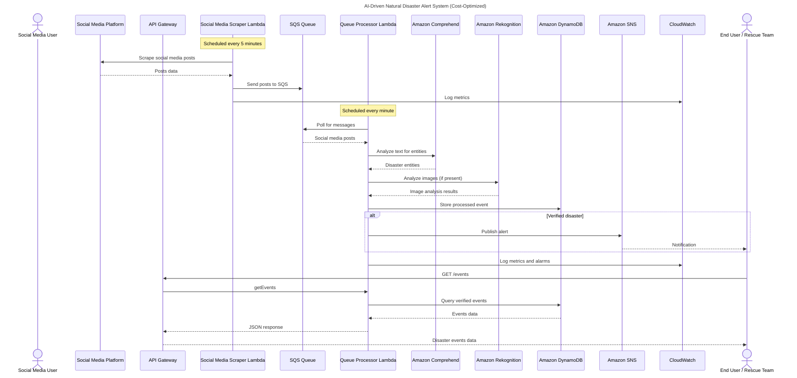

# System Design

## Architecture Overview
- **API Gateway** -> Lambda functions (`processTweet`, `getEvents`, `socialMediaScraper`, `processQueue`)
- **Lambda** -> Comprehend for entity extraction, Rekognition for image analysis
- **DynamoDB** `disaster-events` with GSI `verified-index` and TTL for data lifecycle
- **SNS** `disaster-alerts` for notifications to subscribers
- **SQS** for reliable background job processing with dead letter queues
- **S3** for image storage and processing
- **CloudWatch** for centralized logging, metrics, and alarms
- **Secrets Manager** for secure API credential storage
- **Providers layer** in `packages/shared` for meteo + maps

## Cost-Optimized Services
- **CloudWatch Events** for scheduling (instead of EventBridge)
- **No user authentication** (public disaster alerts)
- **English-only processing** (no translation services)

## Sequence Diagram

## Data Flow
1. **Ingestion**: Social media scraper collects posts from Twitter, Reddit, News APIs
2. **Queue Processing**: Posts are queued in SQS for reliable processing
3. **Analysis**: Text analysis with Comprehend, image analysis with Rekognition
4. **Storage**: Processed events stored in DynamoDB with TTL
5. **Verification**: Business logic determines if event is verified disaster
6. **Alerting**: Verified disasters trigger SNS notifications
7. **Monitoring**: CloudWatch tracks all metrics and system health
8. **API**: Public API exposes verified events to clients
